<div align="center">
  
</div>

<p align="center">
  
</p>

<p align="center">
  <a href="mailto:rmanubag308@gmail.com">
    
  </a>
  <a href="https://linkedin.com/in/rhett-wayne-manubag-207654319">
    
  </a>
  <a href="https://github.com/wayne2604">
    
  </a>
  <a href="https://rhett-manubag-portfolio.netlify.app/">
    
  </a>
  
</p>

<p align="center">
  
  &nbsp;
  
  &nbsp;
  
  &nbsp;
  
</p>


<br>

##  About Me

```typescript
const rhett = {
  role     : "Computer Engineer | Full-Stack Developer | Embedded Systems Specialist",
  location : "Zamboanga del Norte, Philippines",
  focus    : ["React & Next.js", "Mobile Development", "AI & RPA Workflows", "Embedded Systems"],
  strengths: [
    "Bridging hardware (Arduino, PIC microcontrollers) with intelligence",
    "Developing secure full-stack web and native mobile applications",
    "Orchestrating advanced automated RPA & AI pipelines",
    "Technical troubleshooting, network management & cybersecurity",
  ],
  education: "B.S. in Computer Engineering @ Jose Rizal Memorial State University (2022 - 2026)",
  openTo   : "Freelance  •  Full-time  •  Collaboration",
};
```

<br>

##  Tech Stack

<table align="center">
<tr>
<td align="center" width="180">
<b>01 · Core & Languages</b><br><br>

</td>
<td align="center" width="280">
<b>02 · Web & Mobile Frameworks</b><br><br>

</td>
<td align="center" width="180">
<b>03 · Database & Backend</b><br><br>

</td>
</tr>
<tr>
<td colspan="2" align="center">
<b>04 · Dev Tools & RPA Automation</b><br><br>

</td>
<td align="center">
<b>05 · Design & Creative</b><br><br>

</td>
</tr>
</table>

<br>

##  Featured Projects

<table>
<tr>
<td width="50%" valign="top">
<h3>🛡️ OriginShield — AI Content Platform</h3>

[](https://originshield.vercel.app/)
[](https://github.com/wayne2604/originshield)
<br>


Full-stack AI content detection platform that analyzes text, images, and URLs using deep learning models (Sapling AI, Sightengine).

</td>
<td width="50%" valign="top">
<h3>🤖 Nexus-AI — RPA & Workflow Orchestrator</h3>

[](https://us2.make.com/public/shared-scenario/avwaALsS6Nk/integration-circleback)
[](https://github.com/wayne2604/nexus-ai)
<br>


Dual-layered automation engine using GPT-4, OpenAI Whisper, and Playwright to automate meeting transcription and recruitment pipelines.

</td>
</tr>
<tr>
<td width="50%" valign="top">
<h3>🧠 GenMIND — Interactive Learning Platform</h3>

[](https://github.com/wayne2604/genmind)
<br>


Native Android cognitive learning application featuring an adaptive UI built with Jetpack Compose and Firebase real-time sync.

</td>
<td width="50%" valign="top">
<h3>📅 ZNNHS Faculty Scheduling System</h3>

[](https://teacherschedule.vercel.app/)
[](https://github.com/wayne2604/teacher-scheduler)
<br>


Full-stack academic timetabling web app streamlining scheduling and conflict detection for a local high school.

</td>
</tr>
<tr>
<td width="50%" valign="top">
<h3>🔗 PeerLink Navigator System</h3>

[](https://peerlink-mu.vercel.app/)
[](https://github.com/wayne2604/peerlink)
<br>


Web-based counseling platform for anonymous student mental health support and session tracking.

</td>
<td width="50%" valign="top">
<h3>🎬 Viewvie App — Movie Recommender</h3>

[](https://github.com/wayne2604/viewvie-ai)
<br>


Android application with a built-in conversational AI chatbot that suggests personalized films based on current user mood.

</td>
</tr>
<tr>
<td colspan="2" valign="top">
<h3>🚗 Car Rental Hub Website</h3>

[](https://car-rental-hub-two.vercel.app/)
[](https://github.com/wayne2604/car-rental)
<br>


Full-stack booking platform streamlining real-time vehicle reservations and rental inventory management.

</td>
</tr>
</table>

<br>

##  Certifications & Trainings

* 📜 **Visual Graphic Design** — TESDA (2026)
* 🛡️ **Cyber Threat Management** — Cisco Networking Academy (2025)
* 🌐 **Introduction to Cybersecurity & IoT** — Cisco Networking Academy (2025)
* 🤖 **AI Fundamentals** — IBM SkillsBuild (2025)
* 🔌 **Cisco Packet Tracer Getting Started** — Cisco Networking Academy (2025)
* 🎛️ **Establishing & Operating MSMEs** — TESDA (2025)
* 💻 **C++ & Python Core Certifications** — Sololearn (2023)

<br>

##  GitHub Insights

<div align="center">
  
</div>

<br>

<div align="center">
  
</div>

<br>

<div align="center">


<br>

  <strong> Currently open for new opportunities and collaborations.</strong>

  <br><br>

  <em>Let's build something extraordinary together.</em>

  <br><br>

  <a href="mailto:rmanubag308@gmail.com">
    
  </a>
  &nbsp;
  <a href="https://linkedin.com/in/rhett-wayne-manubag-207654319">
    
  </a>
  &nbsp;
  <a href="https://discord.gg/wayne.2604">
    
  </a>

</div>

<br>

<div align="center">
  
</div>
